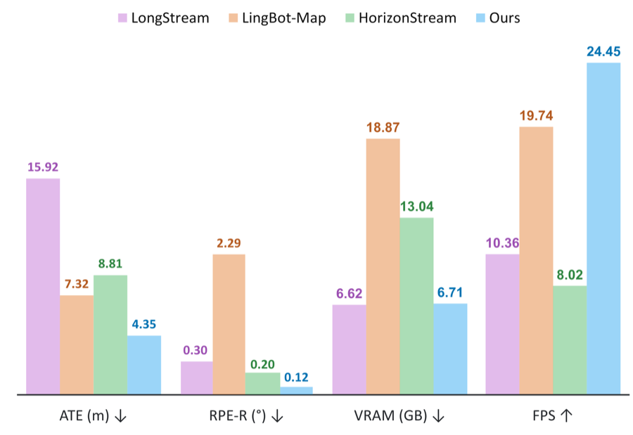

<div align="center">

# ABot-Recon

## Revisiting Local Context for Long-Horizon Streaming 3D Reconstruction

[English](README.md) | [中文](README_ZH.md)

[](https://arxiv.org/abs/2608.27529)
[](https://github.com/amap-cvlab/ABot-Recon/blob/main/ABot-Recon-Tech-Report.pdf)
[](https://amap-cvlab.github.io/ABot-Recon-html)
[](https://github.com/amap-cvlab/ABot-Recon)
[](https://huggingface.co/acvlab/ABot-Recon)
[](https://modelscope.cn/models/amap_cvlab/ABot-Recon)
[](https://modelscope.cn/studios/amap_cvlab/ABot-Recon)
[](https://huggingface.co/spaces/acvlab/abot-recon-streaming-3d)
[](LICENSE)

</div>

<p align="center">
  
</p>

> **一句话介绍：** ABot-Recon 仅使用固定的 12 帧局部上下文处理超长视频流，将当前帧几何与相邻帧相对位姿逐步组合为全局重建，无需持久化的学习式长程记忆。

## 📣 最新动态

- **2026-09-16：** 社区适配：[AXERA-TECH 团队](https://github.com/AXERA-TECH/ABot-Recon-Axera) 已将 ABot-Recon 移植至 Axera AX650N NPU，支持基于 AXCL 的 PCIe 推理和 AX650N 板端推理。该项目提供预编译的 AX650N 模型、Docker 镜像与 Web 建图服务；模型文件可从 [Hugging Face](https://huggingface.co/AXERA-TECH/ABot-Recon-Axera) 下载。感谢 AXERA-TECH 团队完成此次硬件适配！
- **2026-08-31：** 感谢 Hugging Face 团队的支持，ABot-Recon [在线 Demo](https://huggingface.co/spaces/acvlab/abot-recon-streaming-3d) 现已上线，欢迎体验！

## 为什么使用局部上下文？

现有长时程流式重建方法通常通过更加复杂的机制保存并融合长程状态。ABot-Recon 选择了一条严格局部的路径，在每个时刻解决相同且有界的预测问题：

- 缓存此前 11 帧的 KV 特征；
- 在当前相机坐标系中预测点图 $P_i$；
- 估计与前一帧之间的相对位姿 $T_{i-1\leftarrow i}$；
- 通过逐步组合相对位姿恢复全局轨迹和点云。

因此，模型状态占用和单帧计算量均不随已处理序列长度增长。轻量级运动—视觉旋转精修器与组合感知位姿损失进一步抑制局部位姿在长时程组合中的误差累积。

## 结果概览

<p align="center">
  
</p>

| 评测项目 | 结果 | 设置 |
|---|---:|---|
| Oxford Spires 相机位姿 | ATE **4.35 m**，RPE-R **0.12°** | 仅流式模型，不使用回环 |
| Oxford Spires 稠密重建 | CD **1.37 m**，F1 **91.81%** | F1 阈值 $\tau=4$ m |
| KITTI-02 流式效率 | **24.45 FPS**，**6.71 GiB** | 504×280，NVIDIA H100，不计输入存储 |

论文还报告了 KITTI、Oxford Spires 和 VBR 上的相机位姿结果，以及 7Scenes、TUM-Dynamic 和 Oxford Spires 上的稠密重建结果。

## 安装

发布配置面向 Linux、Python 3.10 及以上版本、PyTorch 2.5.1 和 CUDA 12.1。发布环境在 NVIDIA A100 上完成验证，论文中的运行效率则在 NVIDIA H100 上测试。

```bash
conda create -n abot-recon python=3.11 -y
conda activate abot-recon

pip install torch==2.5.1 torchvision==0.20.1 \
  --index-url https://download.pytorch.org/whl/cu121
pip install -e .
```

### 推荐加速组件

若环境中安装了 FlashInfer，ABot-Recon 将使用其分页 KV-cache 算子；否则自动回退至 PyTorch SDPA。编译 cuRoPE 可进一步加速旋转位置编码。

```bash
pip install flashinfer-python
flashinfer show-config

cd abot_recon/modeling/pi3/models/curope
pip install ninja
python setup.py build_ext --inplace
cd -
```

## 模型权重

模型权重已发布至 [Hugging Face](https://huggingface.co/acvlab/ABot-Recon) 和 [ModelScope 魔搭](https://modelscope.cn/models/amap_cvlab/ABot-Recon)。Python API 和演示脚本默认从 Hugging Face 自动下载权重并复用本地缓存。离线推理时，可手动下载并放置在：

```text
checkpoints/abot_recon.safetensors
```

## 快速开始

基础模型不依赖回环相关软件包或权重。输入图像按字典序排序，因此建议使用补零后的帧文件名，例如 `000001.jpg`、`000002.jpg`。

```bash
python demo.py \
  --image-dir examples/images \
  --output-dir outputs/demo \
  --attention-backend auto \
  --no-loop-closure
```

该最小示例对输入序列执行一次因果前向推理，并保存原始相机轨迹、相邻帧相对位姿、局部点图、置信度图和运行元数据。对于包含重访区域的序列，轨迹精修方式见[可选回环](#可选回环)。

常用输出选项：

| 选项 | 作用 |
|---|---|
| `--save-world-points` | 使用最终轨迹变换局部点图并保存全局点云 |
| `--no-save-local-points` | 不保存逐帧局部点图 |
| `--no-save-confidence` | 不保存置信度图 |
| `--confidence-threshold T` | 屏蔽置信度低于 `[0, 1]` 区间内阈值 `T` 的点 |
| `--loop-closure` / `--no-loop-closure` | 开启或关闭可选回环优化；默认开启 |
| `--start`、`--end`、`--stride` | 从排序后的输入流中选择帧 |
| `--dense-stride N` | 估计每个选中帧的位姿，但每隔 `N` 帧保存一次稠密输出 |
| `--max-frames N` | 设置支持的最大序列长度，默认为 `22000` |

### Python API

```python
from pathlib import Path
from abot_recon import ABotRecon

images = sorted(Path("examples/images").glob("*.jpg"))

model = ABotRecon.from_pretrained(
    "acvlab/ABot-Recon",
    device="cuda",
    attention_backend="auto",
    loop_closure=False,
)

result = model.infer(images)

trajectory = result.camera_poses
relative_poses = result.relative_poses
local_points = result.local_points
confidence = result.confidence
```

权重只会下载一次，后续直接从 Hugging Face 缓存加载。离线推理时，将仓库 ID 替换为本地权重路径即可。

设置 `output_world_points=True` 可返回由最终轨迹变换后的世界坐标系点图；若仅需部分帧的稠密几何，可使用 `dense_output_indices`。

## 可选回环

学习式模型本身不依赖回环。当序列中存在有效的重复访问时，可选后端使用 DINOv2-SALAD 描述子检索候选帧对，由 ABot-Recon 预测相对位姿约束，并通过稀疏位姿图优化精修轨迹。

安装可选依赖并下载检索模型：

```bash
pip install -e ".[loop]"
python scripts/download_loop_assets.py --output-dir checkpoints/loop
```

文件结构应为：

```text
checkpoints/
├── abot_recon.safetensors
└── loop/
    ├── dino_salad.ckpt
    └── dinov2_vitb14_pretrain.pth
```

启用回环进行推理：

```bash
python demo.py \
  --image-dir examples/images \
  --output-dir outputs/demo_loop \
  --attention-backend auto \
  --loop-closure
```

启用回环后，`camera_poses` 保存精修后的轨迹，`camera_poses_noloop` 则保留原始流式预测。

## 输出文件

实际生成的文件取决于所选择的输出选项：

```text
outputs/demo/
├── camera_poses.npy
├── relative_poses.npy
├── camera_poses_noloop.npy
├── relative_poses_noloop.npy
├── camera_poses_loop.npy       # 仅在启用回环时生成
├── relative_poses_loop.npy     # 仅在启用回环时生成
├── local_points.pt             # 默认生成
├── world_points.pt             # 使用 --save-world-points 时生成
├── colors.pt                   # 与点图对齐的 RGB
├── confidence.pt               # 默认生成
├── confidence_mask.pt          # 默认生成
└── metadata.json
```

局部点图保留在各自对应的相机坐标系中；世界坐标系点云则使用最终选定的轨迹生成。

### 可视化

```bash
python scripts/export_reconstruction_ply.py \
  --poses outputs/demo/camera_poses.npy \
  --points outputs/demo/local_points.pt \
  --colors outputs/demo/colors.pt \
  --output outputs/demo/reconstruction.ply \
  --bev-output outputs/demo/trajectory_bev.png
```

该命令会生成 RGB 点云 PLY，以及一张独立的 BEV 轨迹图；轨迹不会写入 PLY。

## 评测

相机位姿与稠密重建评测协议维护在 `eval` 分支：

```bash
git switch eval
```

该分支包含数据集准备、第三方权重、评测命令和指标汇总说明。为遵循论文协议，稠密重建评测不使用回环。

## 测试

```bash
pytest -q
```

CUDA 专项测试和真实权重集成测试可分别运行：

```bash
ABOT_RECON_REQUIRE_CUROPE=1 pytest -q tests/test_curope_parity.py

ABOT_RECON_CHECKPOINT=checkpoints/abot_recon.safetensors \
ABOT_RECON_IMAGE_DIR=examples/images \
ABOT_RECON_DEVICE=cuda \
pytest -q tests/integration/test_real_checkpoint.py
```

## 发布状态

- [ ] 训练代码与配置（计划于 9 月 30 日前发布）
- [x] 公开模型权重
- [x] 推理与评测代码

## 引用

```bibtex
@article{abot_recon2026,
  title         = {Revisiting Local Context for Long-Horizon Streaming 3D Reconstruction},
  author        = {{AMAP CV Lab}},
  journal       = {arXiv preprint arXiv:2608.27529},
  year          = {2026},
  eprint        = {2608.27529},
  archivePrefix = {arXiv},
  primaryClass  = {cs.CV},
  doi           = {10.48550/arXiv.2608.27529},
  url           = {https://arxiv.org/abs/2608.27529}
}
```

## 许可证与致谢

源代码采用 [Apache License 2.0](LICENSE)。模型权重遵循 [MODEL_LICENSE.md](MODEL_LICENSE.md)，第三方组件及其许可证记录在 [THIRD_PARTY_NOTICES.md](THIRD_PARTY_NOTICES.md)。

使用模型前，请阅读[模型使用说明](MODEL_USAGE_GUIDELINES_ZH.md)。

ABot-Recon 基于 Pi3 构建，并参考了 CroCo、DUSt3R、DINOv2、SALAD、FlashInfer、LingBot-Map、HorizonStream 和 LongStream。感谢这些工作的作者与贡献者。

## 我们组的其他工作

- [ABot-Earth](https://abot-earth.amap.com/)
- [GS-Voxel](https://arxiv.org/abs/2608.17988)
